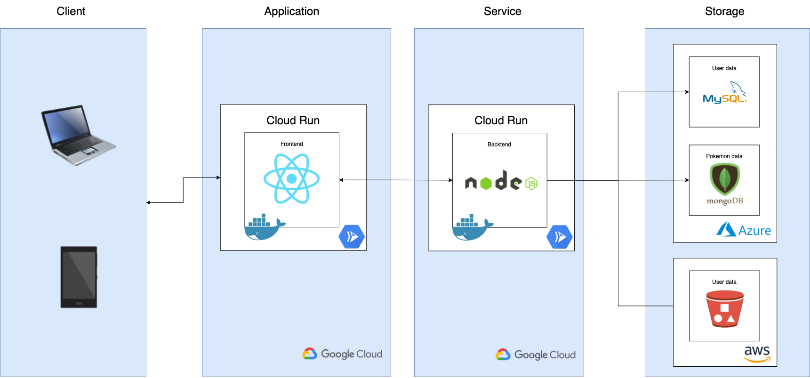
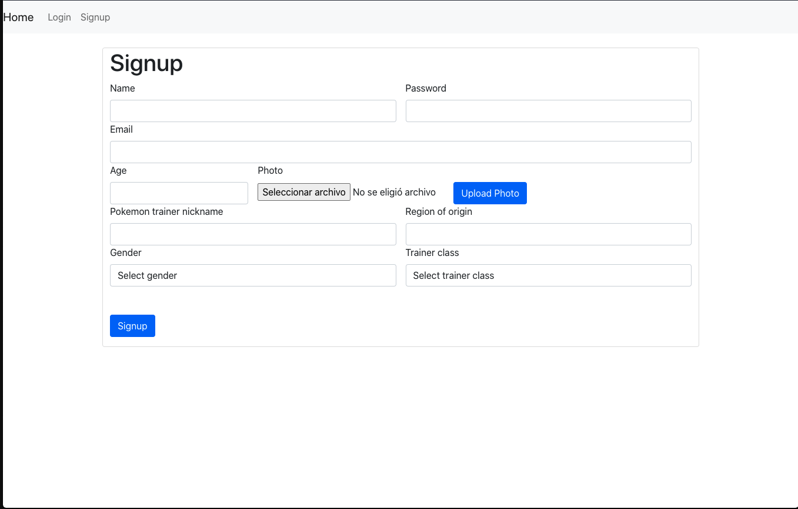
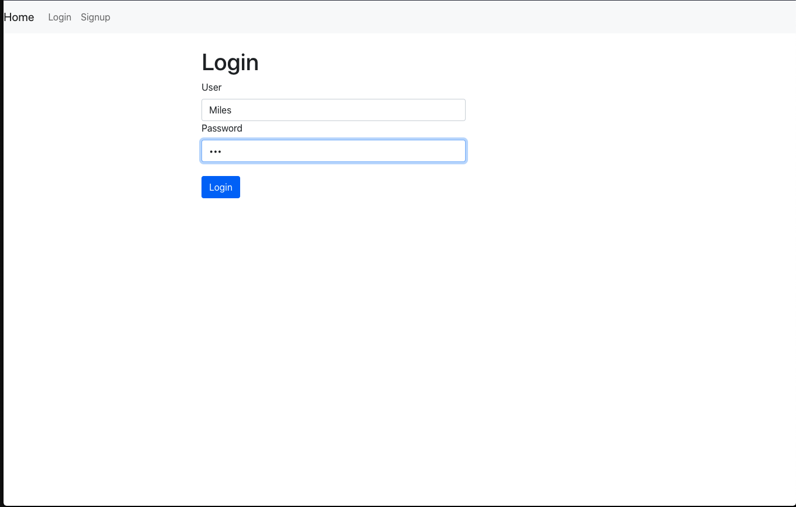
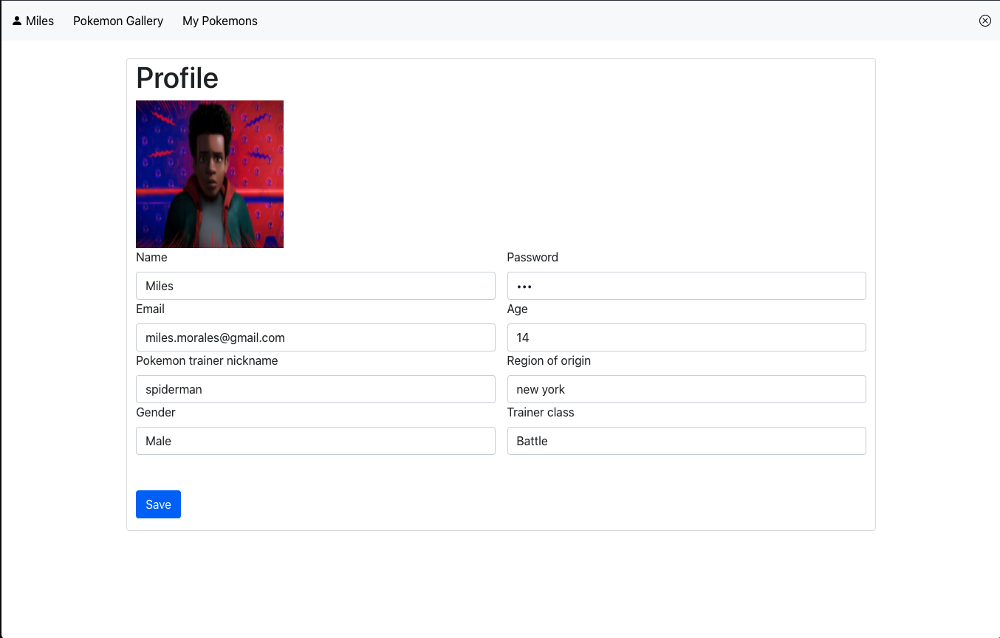
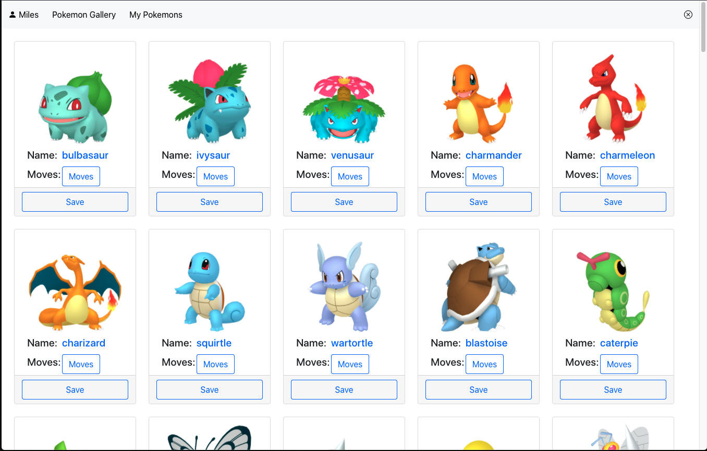
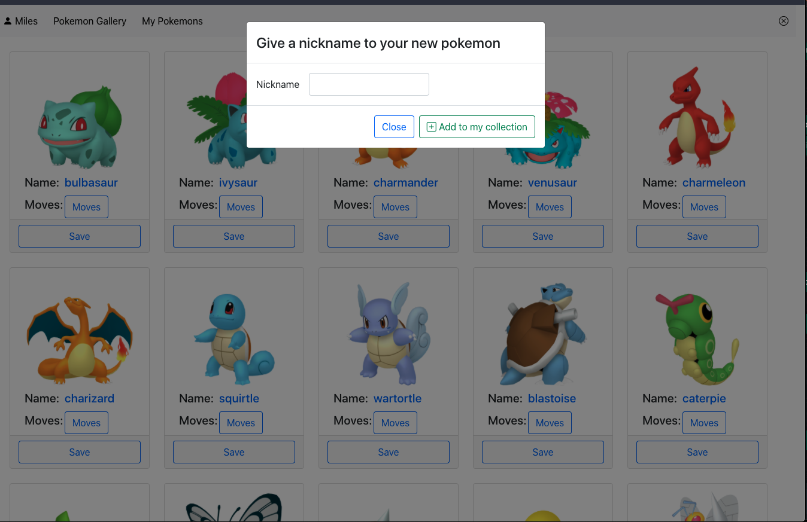
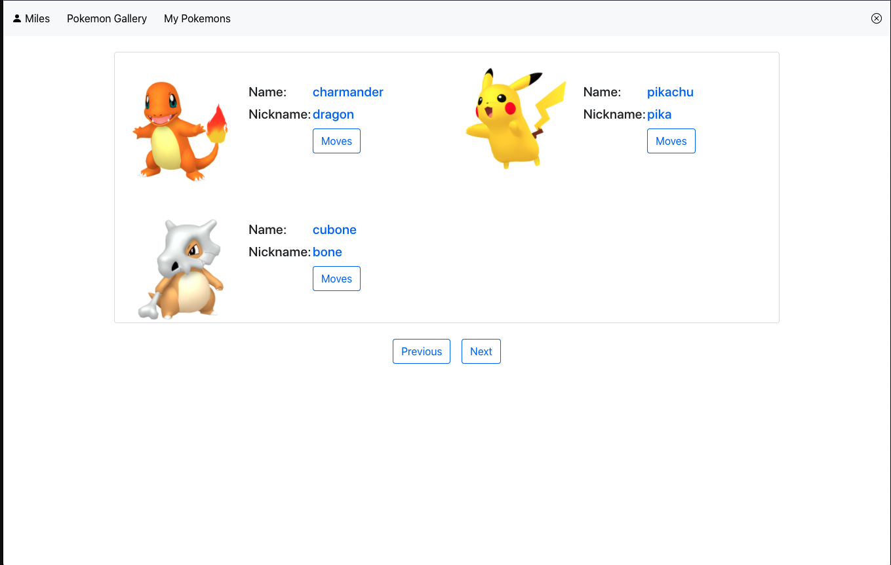

# pokedex

## Code
- [ Frontend ](https://github.com/racarlosdavid/pokedex/tree/frontend)
- [ Backend ](https://github.com/racarlosdavid/pokedex/tree/backend)

## Deployment
- [ Frontend ](https://pokedex-mlsdj2uhea-uc.a.run.app)
- [ Backend ](https://pokedex-backend-mlsdj2uhea-uc.a.run.app)

## Arquitecture

## Signup
If you do not have a user you must fill out the form to create an account

## Login
To enter the pokedex you can do it with your username or email and also with your secret password.

## User Profile
in the profile tab you can review your data and you can also update it if you wish, your photograph is the only one that cannot be updated

## Pokemon Gallery
In the gallery section you can find all the available pokemons, you can see the photo, the name, and the movements of each pokemon.

if you want to add it to your personal collection you must click on the save button. And you can give a nickname to your new pokemon.

## User Pokemons
In my pokemons tab you can see the pokemons you have added so far.

